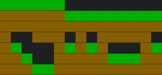

# Terrainifier

This program transforms a file's content into a terrain of grass and dirt.

For example, for the following input:

```

pppppp
ppppppppppppppp
p  ppp p ppppp
pp   ppppp   pp
ppp  pppppppppp
ppppppppppppppp
```

The output will be:

```

gggggg
ddddddggggggggg
ddddddddddddddd
d  ddd d ddddd
dg   dgdgd   dg
ddg  dddddgggdd
dddggdddddddddd
```

`g` corresponds to **g**rass and `d` corresponds to **d**irt.
The `p` in the input file has no special meaning. It can be any character.
The program only distinguishes between whether a character in the input is a space or not.

To make the purpose of this program more clear, here is a visualization of that output:



You can enable this visualization by passing `--colors` as the second argument to the program.

## Compiling

```
javac main/Main.java
```

## Running

```
java main/Main [file] [--colors or --no-colors] [grass character] [dirt character]
```

The program takes at least 1 argument and at most 4.
The first argument is always the name of the input file.
The second argument is, as mentioned above, optionally `--colors` to visualize the output.
Use `--no-colors` if you want to use the next 2 parameters.
The last 2 arguments specify the characters to use for grass and dirt respectively.

For example:

```
java main/Main example --no-colors a b
```

```

aaaaaa
bbbbbbaaaaaaaaa
bbbbbbbbbbbbbbb
b  bbb b bbbbb
ba   babab   ba
bba  bbbbbaaabb
bbbaabbbbbbbbbb
```

## Compiling & running

Here's a handy one-liner for development.

```
javac main/Main.java; java -ea main/Main
```

`-ea` optionally enables assertions. This option is recommended for debugging.

## Tests

We have tests to ensure that the program functions correctly and to make sure there are no regressions when new changes are introduced to the program.

`main/test/input` contains input and `main/test/output` contains the expected output for the inputs.

### Compiling & running

```
javac main/test/Test.java; java -ea main/test/Test
```

If you get no output, the tests succeeded.

## Motivation

Apart from a use case I have for this in another project, my other motivation was to familiarize myself more with Java.
